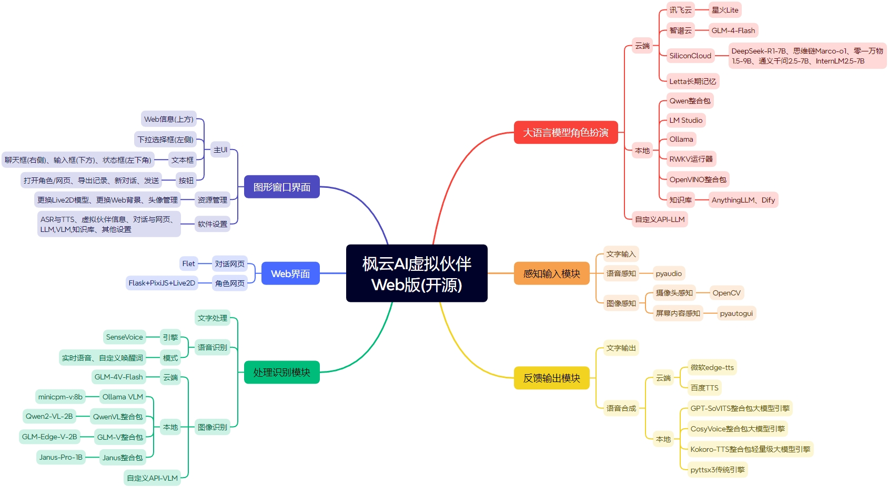

# 枫云AI虚拟伙伴Web版


**枫云AI虚拟伙伴Web版** 是一个高自由度的网页二次元AI数字人框架，本版本系二次创作版本。支持实时语音识别、文本对话、语音合成、图像识别、长期记忆等功能。用户可以通过Web界面与虚拟伙伴进行互动，虚拟伙伴能够根据用户的输入进行智能回复，并支持多种语言模型和语音合成引擎。


## 功能特性

- **高自由度与模块化扩展性**：面向开发者的开源框架，支持修改代码二次开发以实现高度个性化的AI伙伴。
- **广泛的开源AI生态**：对接多种云端/本地大语言模型、多模态模型、语音合成大模型。新增DeepSeek-R1推理模型、Janus-Pro多模态模型支持，并兼容OpenAI标准API。
- **实时拟真语音交互**：通过本地ASR引擎实现实时语音识别，支持流畅的语音交流。语音合成功能支持打断，用户可通过语音、按钮或按键方式中断过长的回复。
- **多模态图像识别**：支持电脑屏幕画面/摄像头内容多模态图像识别。
- **本地知识库**：对接本地AnythingLLM、Dify知识库提升虚拟伙伴的理解与回应精度。
- **多设备全平台访问**：在Windows电脑上运行后，局域网内的设备(如电脑、手机、平板、车机)可通过浏览器展示虚拟伙伴。
- **长期记忆功能**：可选Letta长期记忆框架，通过分层内存管理机制，在不同会话和任务间保持状态，解决传统LLM无状态问题。
- **丰富的自定义设置**：用户可自定义虚拟伙伴的名称、语音、人设、Live2D角色模型等，并个性化配置ASR、TTS、LLM、VLM等模块。



## 安装与使用

### 环境要求

- **操作系统**：Windows 10或更高版本
- **处理器**：Intel Core i5 8th / AMD R5 3000 系列
- **内存**：8GB RAM
- **显卡**：Intel UHD 620 核显 / AMD Vega 7 核显
- **存储空间**：至少2GB可用空间
- **网络**：支持联网使用，也支持下载本地AI引擎DLC离线使用
- **麦克风**：0.5米拾音（语音输入需求）
- **摄像头**：720P彩色（多模态图像识别需求）

### 安装步骤

#### 方法一：通过源码安装(面向开发者)

1. **克隆仓库**

   首先，确保您已经安装了Git。然后，打开命令行工具并运行以下命令来克隆仓库：

   ```bash
   git clone https://github.com/Yscgreedy/ai_virtual_mate.git 
   cd ai_virtual_mate
   ```

2. **安装依赖**

   在项目根目录下，分别运行以下命令安装所需的Python依赖。请忽略红字冲突提示，不影响正常使用：

   ```bash
   pip install -r requirements.txt
   pip install flet==0.13.0
   pip install letta==0.6.7
   ```
    ###注意：letta对python版本有特殊需求（3.10+），如果与你的解释器不兼容可以不下载，但同时软件内letta相关设置将无效。###
3. **配置环境**

   - 修改 `data/db/config.db` 文件中的配置项，设置虚拟伙伴名称、语音识别灵敏度、语音合成引擎等参数。本操作不必执行，但在初次与模型对话前需要在设置中完成配置。
   - 如果需要使用云端免费API，请在 `data/set/key_set.txt` 中填写相应的API密钥。
   - 从 [https://modelscope.cn/models/iic/SenseVoiceSmall-onnx](https://modelscope.cn/models/iic/SenseVoiceSmall-onnx) 下载语音识别模型，解压放入 `data/model` 文件夹。#该网址下载模型似乎不可直接使用，可以下载非开源版本整合包并手动剪切相关文件。

4. **运行应用**

   在项目根目录下，运行以下命令启动应用：

   ```bash
   python main.py
   ```

   应用启动后，可以通过浏览器访问 `http://127.0.0.1:5261` 进入Web界面，若设置中关闭Web部分将无法访问。

#### 方法二：下载安装整合包(简单易上手)
**下载整合包**
    - 本项目不提供整合包，烦请自行部署。
### 使用说明

- **启动软件**：双击运行程序，软件主界面将自动弹出AI虚拟伙伴对话网页。首次使用建议修改默认密码。
- **桌面端操作**：软件默认关闭实时语音交互，按下"Alt+x"可切换实时语音开关。用户也可以在输入框内输入文本与虚拟伙伴进行对话。
- **网页端操作**：通过浏览器访问对话网页，输入用户名和密码登录后即可与虚拟伙伴进行交流。支持导出聊天记录和开启新对话。Web端在非本电脑的其他设备上默认情况下仅支持打字聊天和显示角色，不支持语音识别、语音输出和摄像头识别。如需串流其他设备，推荐使用AudioReplay和iVCam软件。
- **Live2D角色互动**：点击"打开角色"按钮，用户可以通过滑动鼠标或手指与虚拟伙伴进行实时互动，虚拟伙伴的视线会跟随鼠标或手指移动。

## 项目结构

```
ai_virtual_mate_web/
├── data/                    # 数据文件
│   ├── cache/               # 缓存文件
│   ├── db/                  # 配置文件
│   ├── history/             # 对话网页保存聊天记录
│   ├── image/               # 图片资源
│   ├── model/               # 语音识别模型资源
│   ├── set/                 # 设置文件
│   └── momoka/              # 音频文件
├── dist/                    # 静态资源
│   └── assets/              # Live2D模型和Web资源
├── funasr_onnx/             # 语音识别库
├── gui.py                   # GUI相关代码
├── gui_sub.py               # GUI子模块
├── system_init.py           # 系统初始化
├── asr.py                   # 语音识别模块
├── chat_web.py              # Web聊天界面
├── function.py              # 功能函数
├── llm.py                   # 语言模型模块
├── live2d.py                # Live2D模块
├── main.py                  # 主程序
├── tts.py                   # 语音合成模块
├── vlm.py                   # 图像识别模块
└── requirements.txt         # 依赖文件
```

## 配置说明

### 配置文件

- **data/db/config.db**：主配置文件，包含虚拟伙伴名称、语音识别灵敏度、语音合成引擎等配置项。
- **data/set/key_set.txt**：API密钥配置文件，包含SiliconCloud、BigModel、Spark等平台的API密钥。

## 常见问题解答

1. **点击打开角色但不显示怎么办？**
   - 如果是默认角色不显示，可能是Windows系统渲染库问题，建议在另一台电脑上使用。如果是更换后的Live2D不显示，可能是模型兼容性问题或路径配置错误，尝试更换其他模型或恢复默认设置。

2. **服务不可用怎么办？**
   - 检查API Key是否配置正确以及网络连接是否稳定。若网络无问题，尝试更换对话语言模型或语音合成引擎，或下载DLC启用本地AI引擎。

3. **语音识别不完整怎么办？**
   - 前往软件设置调低语音识别灵敏度，保存设置后重启软件。

4. **伙伴语音自我打断怎么办？**
   - 推荐选择自定义唤醒词，避免自我打断；也可以戴耳机使用，或调低扬声器音量。

5. **对话聊天网页显示异常怎么办？**
   - 该问题通常由加速器或代理软件冲突引起，请关闭相关软件。

6. **被杀毒软件清理了怎么办？**
   - 该情况属于误报毒行为，请从隔离区恢复软件并加入白名单（信任区）。
7. **tts（GPT-SoVITS部分）运行异常**
   - 本项目二次开发后的tts模块需要额外配置。
   - 请在`data/momoka`下置入音频文件，默认语言为日文，文件名为文件音频内容，文件根据情感不同需分类在不同子文件夹中，如`LABEL_0`,默认设置下请配置四个`LABEL`文件夹，即0-3。
   - 若`data/momoka`在第一次运行时不存在，软件将尝试创建文件夹，请仅在运行软件后仍不存在该文件夹时再尝试手动创建。
   - 请在LLM的提示词下添加语句：
```
在回答主体完毕后用"|"结尾，并在后面加入回答的日文翻译，要比较口语化，长度不能太短，最后在一个&后写出回答的情绪label，label定义为
EMOTION_MAP = {
    "LABEL_0": ["happy", "joy", "excited", "positive"],
    "LABEL_1": ["sad", "crying", "depressed", "negative"],
    "LABEL_2": ["angry", "furious", "rage"],
    "LABEL_3": ["neutral", "calm", "boring"],
}
如“好啊|好啊（日文）&LABEL_0”
日文与label不计入字数
```

    请注意，目前提示词仅能保证模型按语法输出，实际精确度未经测试，且日文部分存在大量吞字情况。
    在成熟解法实现之前，本项目不会继续优化提示词。

## 开源协议

本项目采用 **GPL-3.0** 开源协议，详情请参阅 [LICENSE](LICENSE) 文件。
## 施工列表
- [ ] 语音识别模块：asr结果根据设置提供两套逻辑，直接提交|置入消息框后手动提交
- [ ] 语音合成模块：根据设置切换合成语言
- [ ] 使用pyQT界面替代原有GUI
- [ ] 使用更合理的方式让tts输出日语，目前解法仅为测试。暂未实现的思路为要求LLM输出json格式回答，保证整体美观。
## 贡献指南

欢迎贡献代码！请遵循以下步骤：

1. Fork 本项目
2. 创建您的特性分支
3. 提交您的更改
4. 推送到分支
5. 提交 Pull Request

## 致谢

- 感谢所有贡献者和用户的支持！
- 感谢以下开源项目的支持：
  - GPT-SoVITS: [https://github.com/RVC-Boss/GPT-SoVITS](https://github.com/RVC-Boss/GPT-SoVITS)
  - opencv: [https://github.com/opencv/opencv-python](https://github.com/opencv/opencv-python)
  - FunAudioLLM: [https://github.com/FunAudioLLM](https://github.com/FunAudioLLM)
  - Letta: [https://github.com/letta-ai/letta](https://github.com/letta-ai/letta)
  - edge-tts: [https://github.com/rany2/edge-tts](https://github.com/rany2/edge-tts)
  - Qwen2-VL: [https://github.com/QwenLM/Qwen2-VL](https://github.com/QwenLM/Qwen2-VL)
  - ollama: [https://github.com/ollama/ollama](https://github.com/ollama/ollama)
  - flet: [https://github.com/flet-dev/flet](https://github.com/flet-dev/flet)
  - flask: [https://github.com/pallets/flask](https://github.com/pallets/flask)
  - live2d: [https://github.com/nladuo/live2d-chatbot-demo](https://github.com/nladuo/live2d-chatbot-demo)

## 联系开发者团队

如有任何问题或建议，请联系开发者团队：

（原始项目开发者）
- **Email**: swordswind@qq.com
- **GitHub**: [swordswind](https://github.com/swordswind)

（二次开发）
- **Email**: 2548674104@qq.com
- **GitHub**: [Yscgreedy](https://github.com/Yscgreedy)